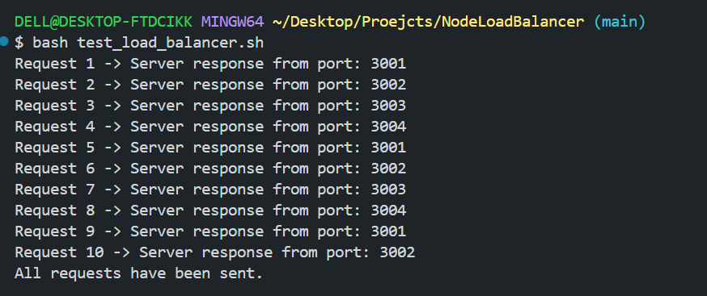

# 🌀 Node Load Balancer — Round Robin Distribution Engine

A lightweight backend implementation of a **Round Robin Load Balancer** built using **Node.js**.  
It distributes incoming requests across multiple backend servers sequentially — similar to real-world load balancers used in microservice architectures.

---

## 🚀 Features

- 🔁 Round-robin request routing (3001 → 3002 → 3003 → 3004 → repeat)
- ⚡ Four backend servers running in parallel
- 🕒 Configurable delay for latency simulation
- 🔗 Built with **http-proxy**
- 🧪 Load-testing support included

---

## 📁 Project Structure
```
Node-Load-Balancer/
│── backendServers.js # Launches backend servers (3001–3004)
│── server.js # Load balancer at port 3000
│── roundRobin.js # Round-robin routing logic
│── config.json # Port + delay settings
│── test_load_balancer.sh # Request load testing script
└── package.json # Dependencies
```

---
## ⚙️ Installation & Setup

1. Install Dependencies

```bash
npm install
```
## 2. Start Backend Servers (Terminal 1)
```
node backendServers.js
```

## 3. Start Load Balancer (Terminal 2)
```
node server.js
```

## 🧪 Testing

### Option A — Browser
Open:
http://localhost:3000

Refreshing should return responses from alternating ports.

#### Option B — CLI Test (Recommended)
➡ Run inside **Git Bash** for correct visible output.

To execute test script:
```
bash test_load_balancer.sh
```
---

### 📸 Output Screenshot  

> Expected CLI output when running test script in Git Bash




If port numbers keep changing → Load balancer is working correctly.

### 🧠 Concepts Used

| Concept               | Where Implemented           |
|----------------------|-----------------------------|
| Load Balancing       | server.js, roundRobin.js     |
| Multi-Server System  | backendServers.js            |
| Request Forwarding   | server.js (using http-proxy) |
| Latency Simulation   | config.json (timeout per server to mimic real latency) |
| Load Testing         | test_load_balancer.sh        |


### 🔥 Future Improvements

| Enhancement             | Impact                               |
|------------------------|---------------------------------------|
| Health Checks & Failover | Skip unresponsive servers automatically |
| Weighted Scheduling     | Faster servers receive more load      |
| Metrics Dashboard      | Live performance visualization         |
| Logging & Analytics    | Improved debugging & observability     |

### 👤 Author

**Kushal Koradia**  
Backend & Distributed Systems Learner  

---

⭐ If you find this project helpful, consider giving it a star!  
💬 Contributions & suggestions are welcome.
